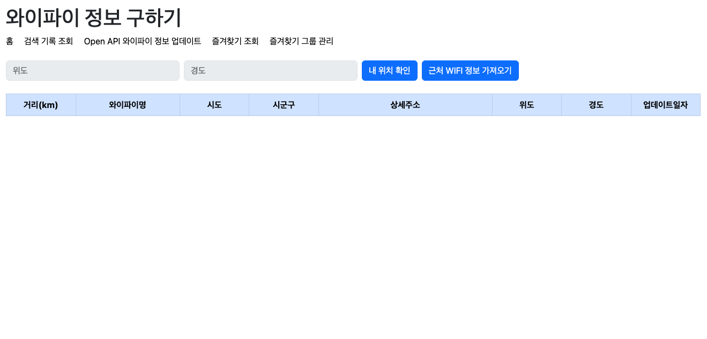
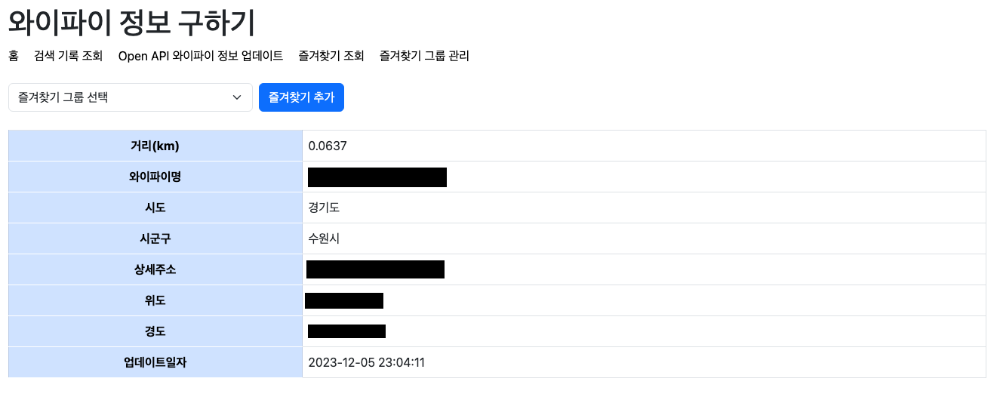
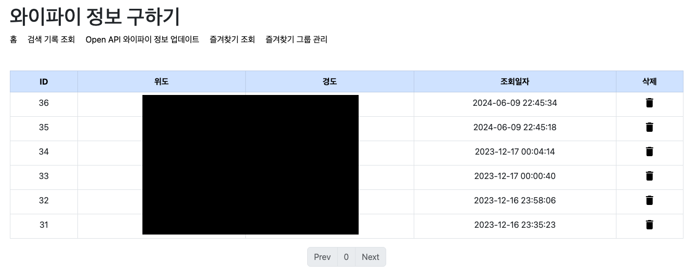
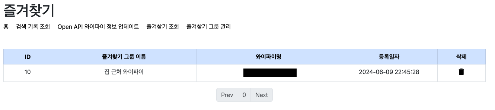
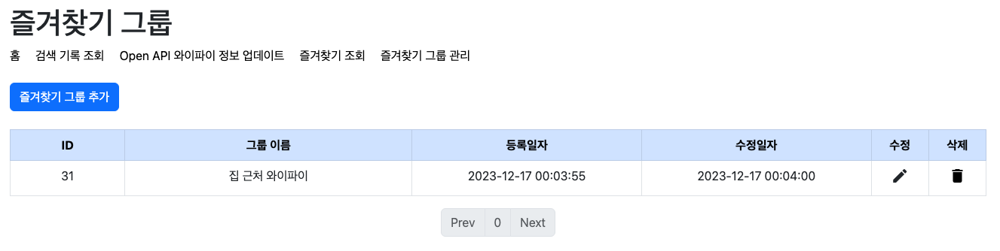
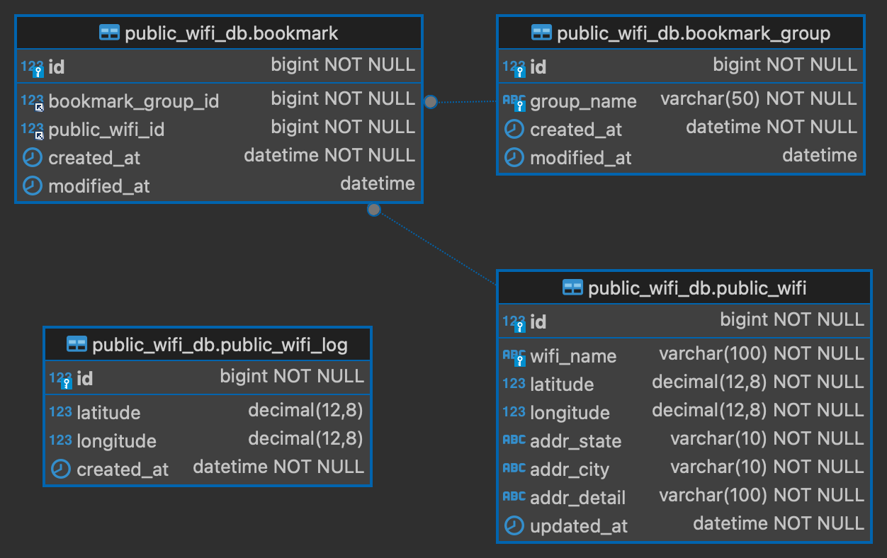

# 내 위치 기반 공공 와이파이 정보를 제공하는 웹 서비스 [2023.11.28 ~ 2023.12.17]

공공 와이파이 데이터 API를 활용하여 사용자의 위치 정보를 기반으로 근처에 있는 와이파이 정보를 화면에 보여주는 웹 서비스

## Development Environment

- IDE: Intellij IDEA Ultimate 2023.2.4
- Build System: Gradle 8.5
- JDK: 17

## Tech Stack

- Spring Boot 2.7
- JPA
- MySQL, H2
- JSP
- [Open API](https://data.seoul.go.kr/dataList/OA-20883/S/1/datasetView.do) [[guide](docs/public_wifi_open_api_doc.md)]

## Features

- 내 위치 정보를 입력하면 가까운 위치에 있는 와이파이 정보 조회
- 가까운 와이파이 검색 기록을 저장/조회/삭제
- 와이파이 상세 정보 조회
- 즐겨찾기 그룹 CRUD
- 와이파이를 즐겨찾기 그룹에 추가/삭제
- 즐겨찾기 조회

### Main Page

- 내 위치 확인
- 근처 WIFI 정보 가져오기

### 즐겨찾기 추가

### 검색 기록 조회

### 즐겨찾기 조회

### 즐겨찾기 그룹 관리

## ERD

